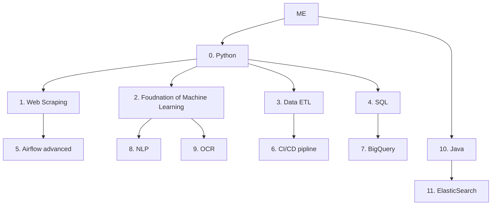

# learning-path
This is the learning path for programming!

```mermaid
  graph TD;
      Z[ME];
      Z --> A[0. Python];
      A --> B[1. Web Scraping]
      A --> C[2. Foudnation of Machine Learning]
      A --> D[3. Data ETL]
      A --> H[4. SQL]
      D --> E[6. CI/CD pipline]
      Z ----> F[10. Java]
      B --> G[5. Airflow advanced]
      H --> I[7. BigQuery]
      C --> J[8. NLP]
      C --> K[9. OCR]
      F --> L[11. ElasticSearch]
      
```
