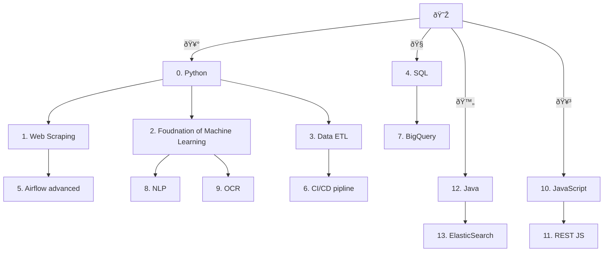

# learning-path
This is the learning path for programming!

```mermaid
  graph TD;
      Z["😎"];
      Z --"🥰"--> A[0. Python];
      A --> B[1. Web Scraping]
      A --> C[2. Foudnation of Machine Learning]
      A --> D[3. Data ETL]
      Z --"ðŸ§"--> H[4. SQL]
      D --> E[6. CI/CD pipline]
      Z --"🙄"----> F[12. Java]
      Z --"🥳"----> M[10. JavaScript]
      M --> N[11. REST JS]
      B --> G[5. Airflow advanced]
      H --> I[7. BigQuery]
      C --> J[8. NLP]
      C --> K[9. OCR]
      F --> L[13. ElasticSearch]
```

# Project Summary
Prepare the project summary ...
